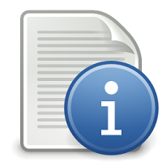

#Vox Launcher

A launcher application to config and run the Vox game executable. Vox can be run separately from the luancher and will function fine without it, but the launcher will auto-update and also allow settings and options to be set outside of running the game.

*(Vox project and source code can be found here: http://www.github.com/AlwaysGeeky/Vox)*

##Features
* Ability to launch Vox game.
* Adjust graphical and rendering options before launching game.
* Save and load settings files.
* News and information relating to Vox, pulled from and online data source.
* Auto-patching for Vox.

##Setup
The launcher is written in C# and is a native .Net application.

##Running
Simply run the provided **VoxLauncher.exe**, this will allow you to config and run the Vox executable in the Vox working directory. Configuration files and uutput settings are written to the 'Vox' game directory under */media/config/*.

##License
This software is provided under the **GNU General Public License**, more information is provided in the [license file](https://github.com/AlwaysGeeky/VoxLauncher/blob/master/LICENSE.md).

##How To Contribute
Contributions are always welcome, either reporting issues/bugs or forking the repository and then issuing pull requests when you have completed some additional coding that you feel will be beneficial to the main project. If you are interested in contributing in a more dedicated capacity, then please contact me.

##Contact
You can contact me via twitter at http://www.twitter.com/AlwaysGeeky. I am always happy to answer questions or help with any issues you might have, and please be sure to share any additional work or your creations with me, I love seeing what other people are making.

#Screenshots
*Coming soon*.
